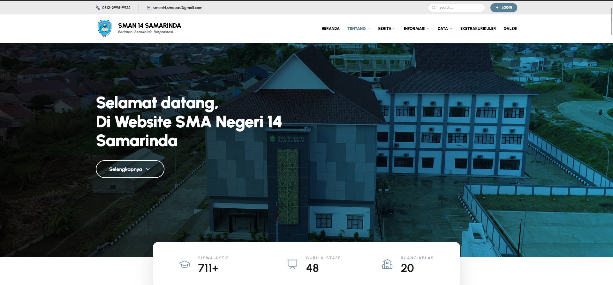

# School Profile Website of SMA Negeri 14 Samarinda

This project is a **School Profile Website** developed as part of my undergraduate thesis.

The purpose of this website is to provide information about the school such as profile, announcements, teachers, classes, gallery, and contact information in a modern and responsive web interface.

---

## Official Website

🌐 [https://your-website-link.com](https://www.sman14samarinda.sch.id/)

---

## Tech Stack

This project is built using:

- React + Vite
- Tailwind CSS
- Sanity Studio

---

## Main Features

### Home Page
The homepage provides a general overview of the school.

Features:
- School introduction
- Principal welcome message
- Latest announcements
- Quick navigation to other pages
- School gallery preview

---

### School Profile
Displays basic information about the school.

Features:
- School introduction
- Vision and mission
- Principal welcome message
- School identity

---

### Announcements
Displays important announcements from the school.

Features:
- Academic announcements
- School event announcements
- Registration announcements

---

### Teachers Page
Displays information about teachers and school staff.

Features:
- Teacher list
- Teacher profiles
- Teacher identification information

---

### Class Information
Provides information about school classes.

Features:
- Class X
- Class XI
- Class XII
- Homeroom teacher information

---

### Extracurricular Activities
Displays extracurricular activities available in the school.

Examples:
- Paskibra
- Futsal
- Badminton
- Other student activities

---

### Gallery
Displays documentation of school activities.

Features:
- School events
- Student activities
- Extracurricular activities
- School facilities

---

### Contact Page
Displays school contact information.

Features:
- School address
- Phone number
- Email
- Google Maps location
- Contact form (optional)

---

## Screenshots

### Homepage

---

### School Profile

---

### Gallery Page

---

## Project Structure
